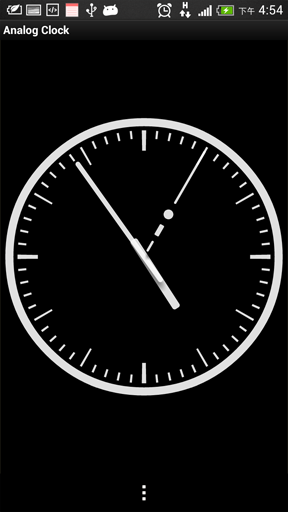
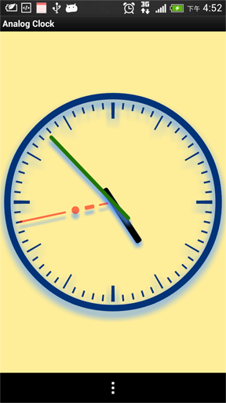

AnalogClock
===========

An analog clock without using any image files.

You can set color by using color code.

 

## Usage

```XML
    <com.gmail.morshues.widget.AnalogClock 
    	...
	    clock:color_dail="#003377"
	    clock:color_hand_hour="@android:color/black"
	    clock:color_hand_minute="#227700"
	    clock:color_hand_second="#88ff0000"
	    clock:color_shadow="#5599FF"
		/>
```

## Copyright And License

This project is released under the terms of the MIT license

Copyright (C) 2014 Morshues